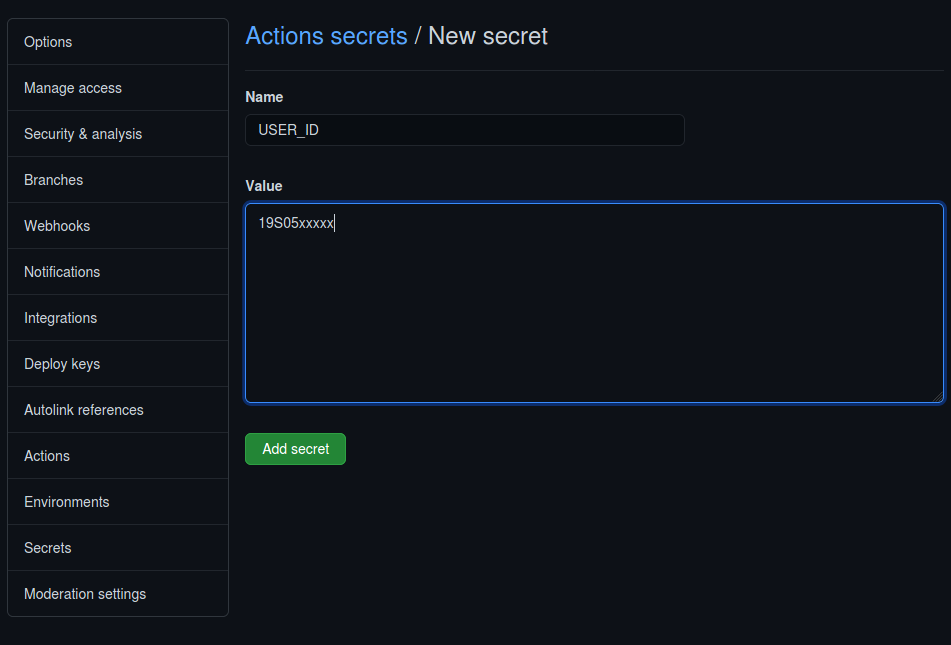
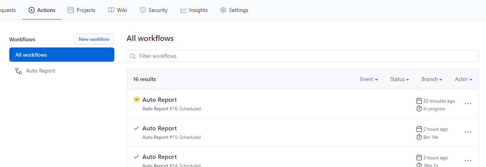
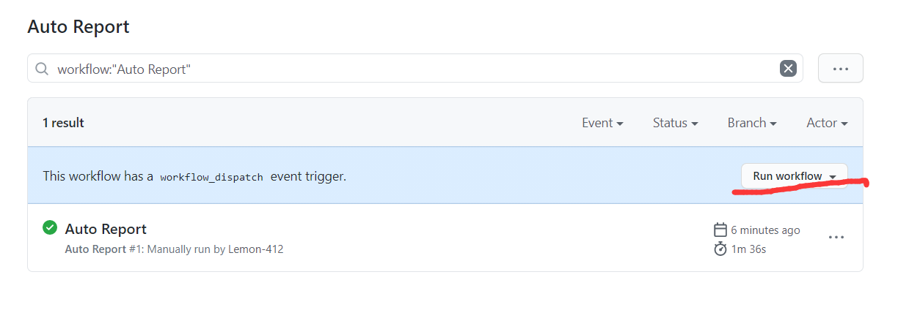

# 哈尔滨工业大学（深圳）疫情每日上报脚本

参照 [github repo 东南大学 疫情每日上报及入校申请自动化脚本](https://github.com/wangyz1997/seu_daily_report)编写，感谢作者。

> 免责声明：本脚本仅为个人为学习python之目的所编写，使用该脚本造成的一切后果均由使用者承担。
本人仍然提倡每日按时手动进行疫情上报与入校申请，配合学校进行好疫情防控。

## 使用方法(离线使用)
### 1. git clone 本仓库 
### 2. 下载WebDriver

ubuntu 下
```bash
sudo apt-get install chromium-browser
```

随后去[chrome-driver](https://chromedriver.chromium.org/downloads)下载对应的chromedriver到该文件夹下

### 3. 下载python依赖
pip3 install -r requrements.txt

### 4. 配置脚本&运行
将config-example.json文件修改为config.json，并填上自己信息门户的学号与密码
随后
``` python3
python main.py
```
## 5. 自动化

自动化部分参照[github repo 上海大学健康之路每日一报/每日两报自动打卡](https://github.com/BlueFisher/SHU-selfreport)
感谢作者

如果需要自动化，则不用git clone该仓库，直接fork。

1. fork 该仓库至你的仓库下
2. 定位到你的仓库的Settings的Secrets选项卡
3. 添加两个secret（New repository secret）
  
    其中一个Name为USER_ID，Value为你的学号(19Sxxxx)，另一个Name为PASSWORD，Value为你的信息门户密码。
    
    

    github repo的secret变量不会被除你以外的任何人看见。

4. 定位到你仓库下的 Actions 选项卡，点击 Enable workflow
    
5. 此时Actions 已经启动完成，每天上午七点（UTC+8）执行一次，每执行一次会在 Actions 选项卡下生成一个报告。

    如果需要对报送功能进行测试，可以点击 run workflow 按钮，立即进行一次运行。
    